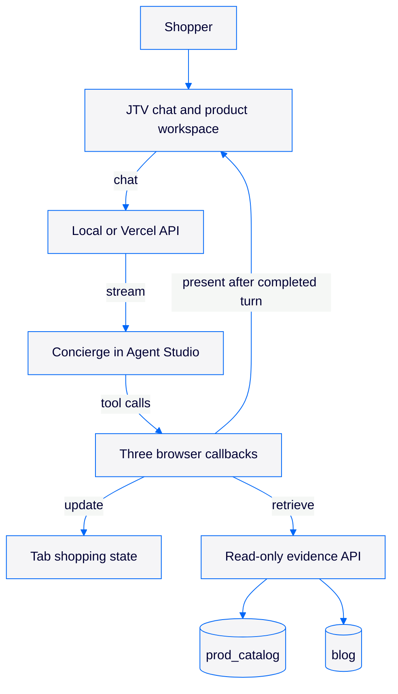

# JTV Concierge demo

A protected JTV-style storefront for exploring jewelry through conversation. One Concierge in Algolia's Agent Studio learns the shopper's preferences, searches the read-only JTV catalogue and guidance, and helps them discover, save, compare and combine pieces. The shopper sees conversation beside a product workspace.

**Status:** This repository is an incomplete Plan 3.1 handoff, not the code currently serving the protected Vercel production alias. The older working app remains live. The new source opens its Concierge in an isolated deployment, but product discovery is blocked by the published Agent Studio tool schema: a model call omitted a required `sourceQuote`, and the dashboard failed twice while saving the proposed schema correction. An anniversary gift flow previously reached a saved shortlist, comparison, JTV blog guidance and a selected necklace; a two-piece look rendered at $239.98. Replacement curation, output guardrails, reload continuity and full acceptance remain open. No checkout, account or authoritative purchase verification is provided.

**Protected hosted app:** [jewellerytv.vercel.app](https://jewellerytv.vercel.app)

**GitHub:** [ArijitChowdhury-Algolia/jewellerytv](https://github.com/ArijitChowdhury-Algolia/jewellerytv)

## How it works



The Concierge owns interpretation, tone, questions, search decisions, curation and explanations. The application owns state, identity, source boundaries, exact arithmetic and display validation. Its three client-side tools are `update_shopping_state`, `retrieve_evidence` and `present_choices`. Product and blog indices and all index settings remain read-only. The app does not contain canned Concierge replies or a second conversational router.

The browser keeps the current shopping mission in session storage. Saved, Compare and manual Combination share that state. A new conversation keeps Saved while resetting the brief and working selection. The longer-term Saved/Compare session lifecycle has not been decided. Agent Studio memory is off, and there is no login or cross-device state.

## Run locally

Use Node.js 24 and npm. Supply the server-side Algolia values and published Concierge agent ID in the project-root `.env.local` as described in [the environment template](storefront/.env.example). The two environment variables may name the same agent. Do not put credentials in `VITE_*` variables or Git.

```sh
cd storefront
npm ci
npm run dev
```

Open `http://localhost:5173`. The local API runs on `127.0.0.1:5174`. The [storefront guide](storefront/README.md) covers the source modules and checks. The [deployment guide](storefront/docs/deployment.md) covers the protected Vercel snapshot and rollback.

## Verification and limits

The local build uses TypeScript, Vitest, ESLint and dependency checks. The live Concierge and guardrail must be judged through actual connected browser journeys. A successful tool receipt, a green unit suite or a deployed page is not proof of a complete shopping experience. The current release's exact test, CI, agent and deployment identities belong in the [snapshot handoff](storefront/docs/PLAN-3.1-STATUS.md).

The hosted demo must retain Vercel Authentication. Git-triggered deployments are disabled; a GitHub push does not deploy. Customer index records, rankings, synonyms and settings must never be changed as part of this project. JTV marks and imagery are demo references and do not imply endorsement.
