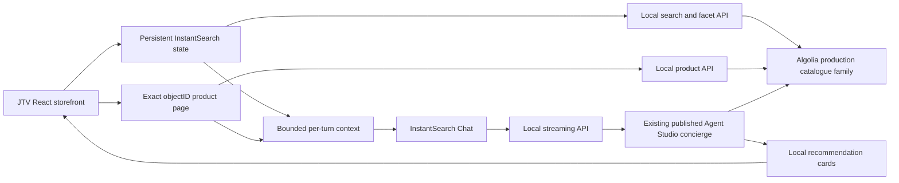

# JTV concierge demo

A local JTV-style storefront for testing the existing jewelry buying concierge against live Algolia catalogue data.

## Run

```sh
cd storefront
npm ci
npm run dev
```

Open http://localhost:5173. One command runs Vite and the Node API. Both are local-only; the API listens on 127.0.0.1:5174. Stop with Ctrl+C. The launcher enables Node's system certificate trust without disabling certificate validation.

The API reads `ALGOLIA_APP_ID` and `ALGOLIA_SEARCH_API_KEY` from the parent project's `.env.local`. It does not expose that file or either credential to the frontend. No `VITE_*` credentials are needed. For the protected Vercel deployment, see [the deployment guide](docs/deployment.md).

## Shopping flows

- Shop six core departments; refine price, available size, stone, material and category-specific attributes.
- Switch Featured, Newest, Top Rated and price ordering using the existing replicas.
- Open exact product/style records. Product-family identifiers never replace object identity.
- Select an available size and click **Ask about this item**.
- Use the floating concierge button from any page. Product cards open local product pages; conversation survives client-side navigation.
- **New conversation** stops generation and resets the client conversation ID, messages and record cache. Full reload also starts fresh. These actions do not delete server-held history or disable the live agent's memory setting.
- **Demo diagnostics** shows the page context and outgoing request timings in development mode.

## Architecture




All API upstream hosts, routes and indices are fixed/allowlisted. Search analytics, click analytics and A/B testing are disabled. The main concierge uses the existing agent completion endpoint. Optional brief proposals use a separately configured extractor agent. No administrative write endpoint is exposed.

Product facts come from the connected catalogue and may differ from JTV's website. Prices, sizes and availability are not checkout confirmation. The demo omits payments, accounts, auctions, TV streaming and editorial search. Secondary navigation identifies these boundaries explicitly. Saved pieces and a shopper-confirmed brief belong to the client shopping workspace, not a JTV account.

## Verification

```sh
npm run typecheck
npm test
npm run build
npm run test:e2e -- --list
```

`npm test` runs data, routing, context and API tests with injected upstream adapters. Browser regression source lives in `tests/e2e`; running `npm run test:e2e` requires the local server and installed Chrome. These regression scenarios mock historical catalogue records and block model calls. Fixture data is never an automatic fallback for failed live requests.

Live browser checks were performed separately through the connected Chrome tool. See `evidence/VALIDATION.md` for exact scope, live conversations, screenshots and limits. Do not confuse Playwright test discovery with execution.

React InstantSearch is pinned at 7.51.0, core 7.51.0 and InstantSearch.js 4.119.0. The catalogue is read-only. Agent ID: `ba2bb723-0459-4df6-ba8b-812088f39f0f`.

## Evidence and recovery

`npm run snapshot` (with `NODE_USE_SYSTEM_CA=1`) saves a read-only snapshot of the current agent configuration and hashes. It never applies local prompt files. Snapshots contain configuration but no API key; keep them as local evidence.

If search or chat fails, use its visible error/retry control. There is no mock-agent fallback. A failed or pending listing blocks page-grounded chat until results settle, so a new filter cannot be paired with stale product IDs. Context over platform limits produces a visible message and prevents sending.

Rollback consists of stopping the local processes. No index settings, records, prompts, guardrails or memory configuration are changed by this application.
